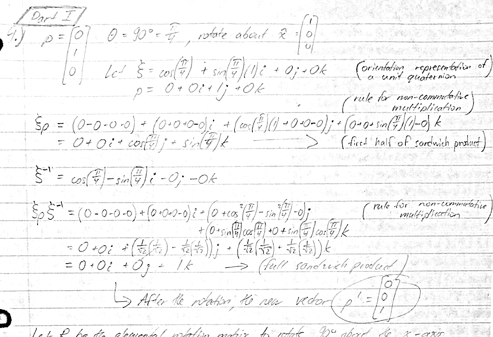
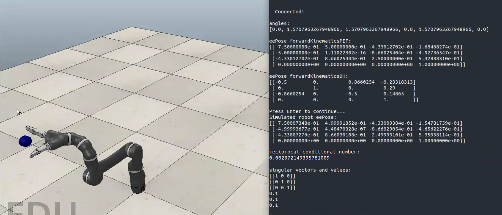

# csc376

## Assignment 1: Rotation and Transformation of Rigid Bodies
[huts_roman_csc376_a1.pdf](./a1/huts_roman_csc376_a1.pdf) 

## Assignment 2: Forward Kinematics
[csc376_assignment2.pdf](./a2/csc376_assignment2.pdf) 

## Assignment 3: Probabilistic Roadmap Planning for Navigating 3D Task Space with Obstacles
[README.md](./a3/README.md) 

